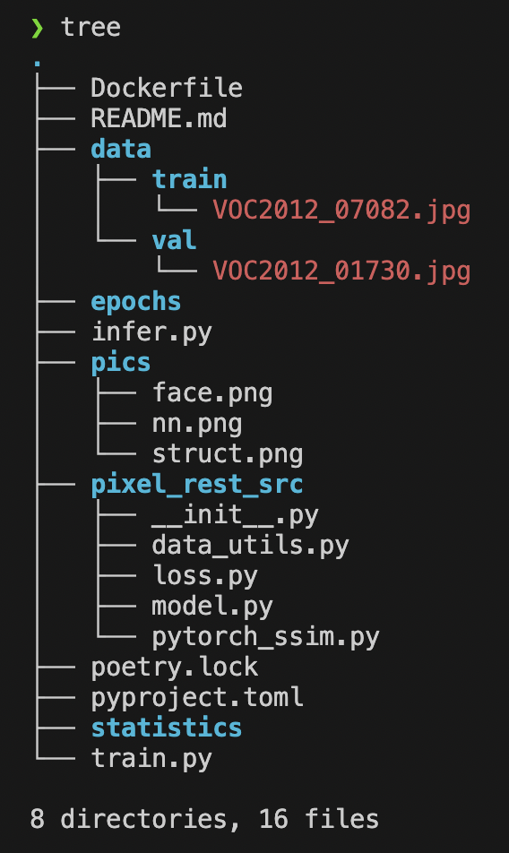
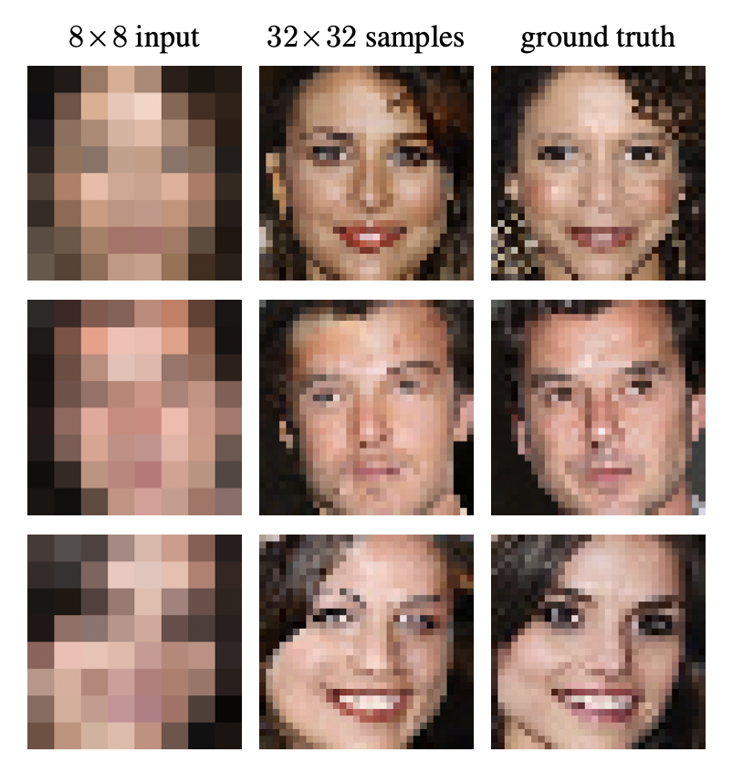
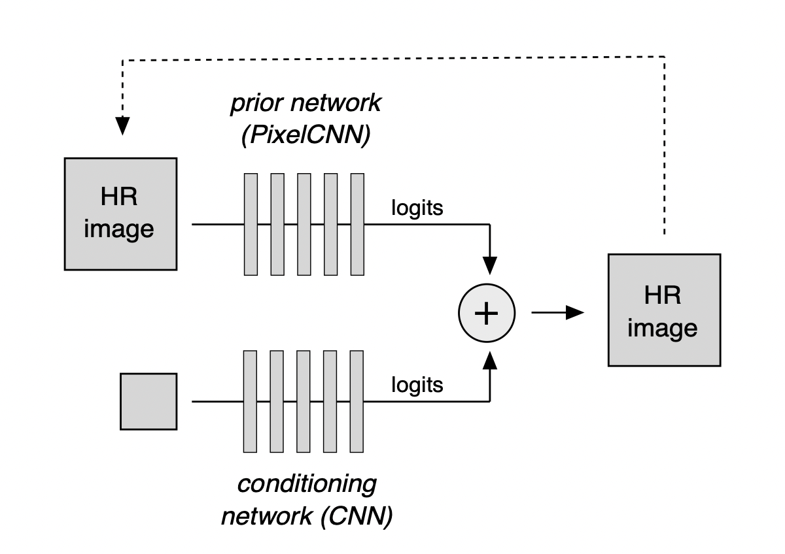

# MLOps Pixel Recursive Super Resolution

## Project Structure:

- The epochs directory contains the model checkpoints
- The pixel_rest_src directory contains source files
- The statistics directory stores graphs of metrics after model training.
- Dependencies are described in pyproject.toml

## 1. Problem Statement:

- ### Project Objective:

We want to develop a deep pixel restoration model to improve the image quality
(see papyr.
[https://arxiv.org/pdf/1702.00783.pdf](https://arxiv.org/pdf/1702.00783.pdf))

- ### Why it is needed:

  1. It's fanout. A user can upload an image and the output is something better.
     Or give a sketch of a certain picture and get a a finalized one.
  2. It allows you to reconstruct missing information or even decipher scrolls
     ([https://www.bloomberg.com/features/2024-ai-unlock-ancient-world-secrets/](https://www.bloomberg.com/features/2024-ai-unlock-ancient-world-secrets/))

## 2. Data:

- ### Data sources:

DIV2K dataset (https://data.vision.ee.ethz.ch/cvl/DIV2K/), which contains high
quality images of various resolutions. This dataset was used in the original
Pixel Recursive Super Resolution article, but you can also use other datasets
from the google repository. other datasets from the google repository.

- #### Data Features:

800 images for training and 100 images for testing. Different domains.

- #### Possible problems:

  1. Not enough data to train the model. (It is possible to find other datasets
     for other domains).
  2. Also, there may be problems with differences in lighting, noise, some other
     artifacts in the images.

## 3. Modeling approach:

- ### Models and libraries:

SRGAN (Super-Resolution Generative Adversarial Network) or EDSR (Enhanced Deep
Super-Resolution).

- ### Solution Configuration:

The model will be trained on the DIV2K training dataset. The model will have a
convolutional architecture with multiple layers and will utilize a loss function
such such as mean square error (MSE) or perceptual loss (perceptual loss) for
training.

## 4. Prediction method:

- ### Wrapping the model in the production pipeline:

Once the model is trained, it can be integrated into the production pipeline.

The payline is planned as follows:

    1. Uploading images
    2. Pre-processing (e.g. resizing images)
    3. Inferring the deep pixel restoration model and saving the improved images.

- #### Final Application:

The final application of the model can be to improve the quality of images in
real time. For example, one could reconstruct people's faces in real time or
make a sticky service to infinitely deep reconstruct a photos.
